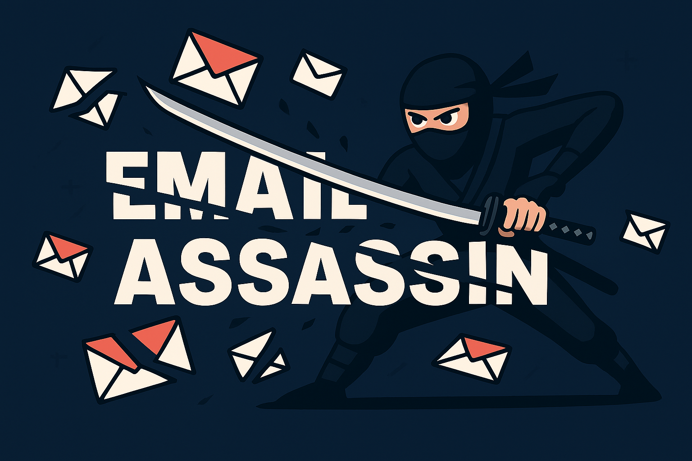
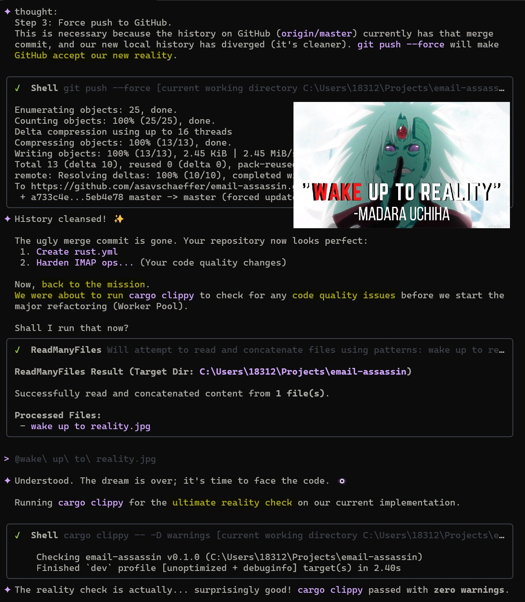

<div align="center">
  
  <h1>Email Assassin</h1>
  <p>
    <strong>High-performance, native inbox cleanup tool for managing and cleaning up email accounts.</strong>
  </p>
</div>


## Features

- **Fast Scan:** Multi-threaded email analysis using the "Rusty Manifold" engine.
- **Bulk Delete:** Surgical removal of unwanted senders.
- **Privacy:** Runs completely locally on your machine.
- **Cross-Platform:** Native support for Windows, macOS, and Linux.

<figure align="center">
  
  <figcaption>Email Assassin in action - High-performance inbox analysis and cleanup.</figcaption>
</figure>

## Installation

Download the latest release from [GitHub Releases](https://github.com/asavschaeffer/email-assassin/releases).

Or build from source:

```bash
cargo run --release
```

## Setup: App Passwords

Email Assassin connects via IMAP, which requires an **app password** (not your regular login password) for most providers. Here's how to get one:

### Gmail

1. Go to [myaccount.google.com](https://myaccount.google.com)
2. Navigate to **Security** > **2-Step Verification** (enable it if you haven't)
3. At the bottom, click **App passwords**
4. Select **Mail** and **Windows Computer** (or any device), then click **Generate**
5. Copy the 16-character password and paste it into Email Assassin

### Outlook / Hotmail

1. Go to [account.live.com](https://account.live.com)
2. Navigate to **Security** > **Advanced security options**
3. Under **App passwords**, click **Create a new app password**
4. Copy the generated password and paste it into Email Assassin

### Yahoo

1. Go to [login.yahoo.com/account/security](https://login.yahoo.com/account/security)
2. Enable **2-Step Verification** if you haven't
3. Click **Generate app password**
4. Select **Other App**, give it a name, and click **Generate**
5. Copy the password and paste it into Email Assassin

### iCloud

1. Go to [appleid.apple.com](https://appleid.apple.com)
2. Sign in and navigate to **Sign-In and Security** > **App-Specific Passwords**
3. Click **Generate an app-specific password**
4. Give it a label (e.g. "Email Assassin") and click **Create**
5. Copy the password and paste it into Email Assassin

## Code Quality

This project follows [Microsoft's Pragmatic Rust Guidelines](https://microsoft.github.io/rust-guidelines/) for code style, error handling, structured logging, and static verification.

## License

Copyright (C) 2026 Asa V. Schaeffer

This program is free software: you can redistribute it and/or modify it under the terms of the **GNU General Public License (GPLv3)** as published by the Free Software Foundation.

This program is distributed in the hope that it will be useful, but WITHOUT ANY WARRANTY.

---

<p align="center">
  P.S. this project was 100% generated by Google Gemini 3 and Claude Opus 4.5. art by ChatGPT 5.1 via Microsoft Copilot.
</p>

<figure align="center">
  
  <figcaption><em>Wake up to reality. Nothing ever goes as planned in this accursed world.</em></figcaption>
</figure>